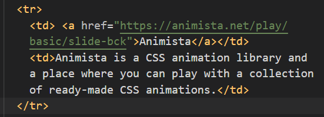

# Contributing Guidelines

Welcome!

We're excited that you're interested in contributing to our open-source project. Whether you're new to open source or an experienced developer, we want your contributions to be smooth and enjoyable. Below, you'll find some guidelines and tips to help you get started.

Please adhere to and review our [Code Of Conduct](https://github.com/jfmartinz/ResourceHub/blob/main/CODE_OF_CONDUCT.md).

You can find all my socials [here](https://www.biodrop.io/jfmartinz). 

## Important Rules

To ensure a smooth experience, please follow these important rules:

1. **Relevance**: Make sure that the resource you're adding matches the category. Web development resources go in the web development section, UI/UX design resources in the UI/UX design section, and so on.

2. **How to Add a Resource**:

   **URL Format**: When adding a resource, follow this format:

   ```markdown
   <a href="URL_here">Resource Name</a>
   ```

   **Add to Table**: Insert it into the table like this:

   ```markdown
   <tr>
      <td><a href="URL_here">Resource Name</a></td>
      <td>URL Description</td>
   </tr>
   ```

   > Note: Replace "URL_here" with the actual resource URL and provide a brief description.

   For example:

   

## Ways to Contribute

There are many ways to contribute, and you don't need to be a coding wizard to get involved. Here are some beginner-friendly ways to contribute:

- **Fix Typos or Grammar**: Help us maintain clean and error-free content. Raise an [issue](https://github.com/jfmartinz/ResourceHub/issues/new?assignees=&labels=bug&projects=&template=bugreport.yml&title=%F0%9F%90%9E+%5BBUG%5D+-+%3Ctitle%3E)

- **Add Valuable Resources**: If you find a resource that you think would benefit others, share it with the community.

- **Documentation Updates**: Improve project documentation, or let us know if something is unclear.

- **Share Ideas**: Have a suggestion or an idea for project improvement? Raise an [issue](https://github.com/jfmartinz/ResourceHub/issues/new?assignees=&labels=feature&projects=&template=feature.yml&title=%F0%9F%92%A1+%5BFEATURE%5D+-+%3Ctitle%3E).

- **Outdated or broken link**: If you encounter broken links or outdated resources, please let us know so we can keep things up to date. Or if you have any resource that you can add as alternative, then raise an [issue](https://github.com/jfmartinz/ResourceHub/issues/new?assignees=&labels=bug&projects=&template=bugreport.yml&title=%F0%9F%90%9E+%5BBUG%5D+-+%3Ctitle%3E).

We recommend that if you're simply adding a resource to a specific category, there's no need to create an issue and submit a pull request (PR) automatically.

Thank you for taking the time to read these guidelines. We appreciate your interest and look forward to your contributions to this project. 

Happy contributing! 🚀
