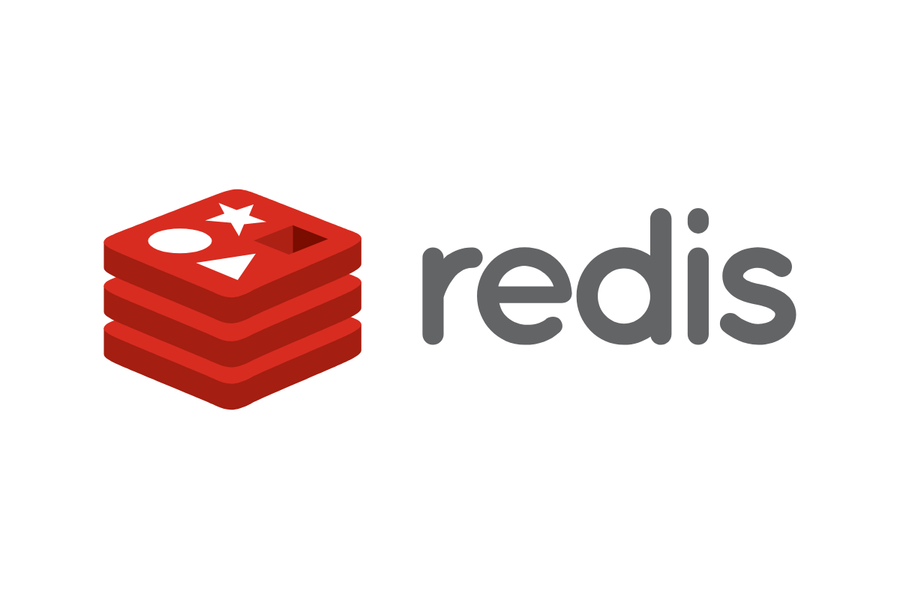
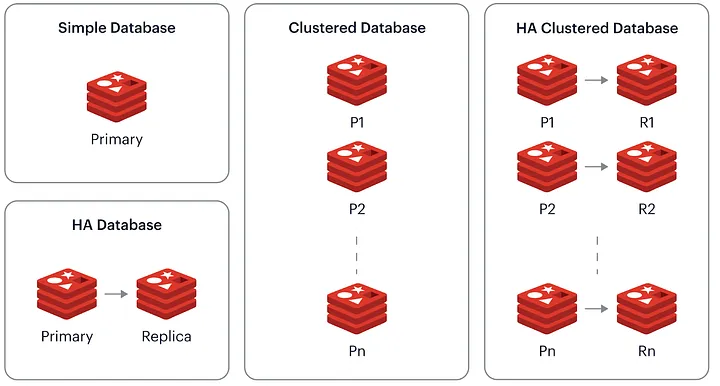

# Redis

Redis is an open-source, in-memory data structure store that can be used as a database, cache, and message broker. It supports various data structures such as strings, hashes, lists, sets, and more, making it versatile for a wide range of use cases including caching, real-time analytics, messaging, and session management.

Redis is an in-memory data structure store that can be used as a database, cache, and message broker. It is designed to be fast and scalable, and it is capable of handling large amounts of data with low latency.

One of the key features of Redis is its in-memory database architecture, which allows it to store data in RAM for faster access and processing. This makes Redis ideal for use cases where high performance is required, such as real-time analytics, leaderboards, and cache management.

Redis is also designed to be highly available and fault-tolerant, with features such as replication and clustering to ensure that data is not lost in the event of a hardware failure or network issue.

It supports a wide range of data structures and operations, including strings, lists, sets, hashes, and sorted sets, and provides support for data persistence, transactions, and Lua scripting.

Redis is commonly used as a database, cache, and message broker, and is well-suited to a variety of use cases, including real-time analytics, leaderboards, full-text search, and message queues. Its in-memory design allows it to process requests and perform operations much faster than traditional disk-based databases, making it a popular choice for high-performance applications.

The purpose of a Redis roadmap is to outline the key features and capabilities of Redis and to provide a high-level overview of how it can be used to solve specific problems and meet the needs of different types of applications. By understanding the capabilities of Redis, developers and administrators can effectively use it to build and maintain high-performance systems and applications.

## Table of Contents

- [Roadmap](#roadmap)
- [Redis](#redis-1)
    - [Introduction](#introduction)
    - [Installation and Setup](#installation-and-setup)
- [Basic Concepts](#basic-concepts)
    - [Data Structures](#data-structures)
    - [Basic Commands](#basic-commands)
    - [Pub/Sub Messaging](#pubsub-messaging)
- [Redis Commands](#redis-commands)
- [Intermediate Concepts](#intermediate-concepts)
- [Advanced Concepts](#advanced-concepts)
- [Performance and Optimization](#performance-and-optimization)
- [Integrating Redis with Applications](#integrating-redis-with-applications)
- [Practical Projects](#practical-projects)
- [Redis Documentation](#redis-documentation)
- [Books](#redis-books)
- [Language Bindings](#language-bindings)
- [Tutorials](#tutorials)

### Roadmap
> A structured plan or guide for learning and working with Redis, covering various topics and milestones.

Familiarize yourself with the basics of Redis and how it works. This might include reading the Redis documentation, understanding the different data types it supports (strings, lists, sets, hashes, etc.), and learning about its in-memory database architecture.

To use Redis, you will need to install it on your local machine or a server. Once installed, you can connect to the Redis server using a command-line interface (CLI) or a client library in your programming language of choice. Try out some of the basic commands such as SET, GET, and INCR to get a feel for how Redis works.

Learn about Redis data persistence and how to configure it to store data on disk. This is important for ensuring that your data is not lost in the event of a power outage or system crash.

Experiment with Redis data structures and learn how to use them to store and retrieve data efficiently. This might include learning how to use hashes to store key-value pairs, lists to implement queues and stacks, and sets to store unique elements.

Learn how to use Redis in a multi-threaded environment, including how to use transactions and the MULTI/EXEC command to ensure data consistency.

Consider using Redis in a real-world application to get a feel for how it performs in a production environment. This might include integrating it with a web application or using it to store real-time data such as user activity or analytics.

Continue learning about advanced Redis features such as replication, clustering, and distributed locks to further optimize your use of the database.

- **Data storage:** Redis stores data in RAM as key-value pairs supporting various data types like string, list, set, hash, and sorted set, with options for persistence.
- **Memory management:** Redis employs dynamic memory allocation to optimize efficiency and includes eviction policies for memory management.
- **Networking:** Redis features a built-in networking layer for client communication via protocols like TCP and Unix sockets, supporting connection pooling.
- **Replication:** Redis supports master-slave replication for data redundancy and fault tolerance, with slaves replicating data from a master.
- **Clustering:** Redis clustering facilitates horizontal scaling by distributing data across shards on multiple instances, supported by replication, load balancers, and query routers.

<table>
  <tr>
    <th>Resource Name</th>
    <th>Description</th>
  </tr>
  <tr>
    <td><a href="https://redis.io/topics/roadmap">Redis Roadmap</a></td>
    <td>Details on the development roadmap for Redis, including upcoming features and enhancements.</td>
  </tr>
</table>

### Redis 
> Redis is an open-source, in-memory data structure store that supports various data structures and operations. It is commonly used for caching, session management, real-time analytics, and more.

### Introduction 
> Overview and introduction to Redis, including its features and capabilities.

<table>
  <tr>
    <th>Resource Name</th>
    <th>Description</th>
  </tr>
  <tr>
    <td><a href="https://redis.io/topics/introduction">Introduction to Redis</a></td>
    <td>An overview of Redis, its features, and typical use cases.</td>
  </tr>
  <tr>
    <td><a href="https://www.tutorialspoint.com/redis/redis_overview.htm">Redis Overview</a></td>
    <td>Introduction to Redis, explaining its features and benefits.</td>
  </tr>
  <tr>
    <td><a href="https://www.javatpoint.com/redis-tutorial">Redis Tutorial</a></td>
    <td>Tutorial covering the basics of Redis and its application in various scenarios.</td>
  </tr>
</table>

### Installation and Setup 
> Instructions on how to install and set up Redis for development.

<table>
  <tr>
    <th>Resource Name</th>
    <th>Description</th>
  </tr>
  <tr>
    <td><a href="https://redis.io/download">Download Redis</a></td>
    <td>Official Redis download page with installation instructions for various platforms.</td>
  </tr>
  <tr>
    <td><a href="https://www.digitalocean.com/community/tutorials/how-to-install-and-secure-redis-on-ubuntu-20-04">Install Redis on Ubuntu</a></td>
    <td>Step-by-step guide on installing and securing Redis on Ubuntu 20.04.</td>
  </tr>
</table>

### Redis Commands
Redis Commands
GET: Retrieves the value of a key.

Example: GET mykey retrieves the value of the key “mykey”.

SET: Sets the value of a key.

Example: SET mykey “hello” sets the value of the key “mykey” to “hello”.

DEL: Deletes a key.

Example: DEL mykey deletes the key “mykey”.

EXISTS: Checks if a key exists.

Example: EXISTS mykey checks if the key “mykey” exists.

KEYS: Gets all keys that match a pattern.

Example: KEYS * gets all keys in the database.

EXPIRE: Sets a time-to-live for a key.

Example: EXPIRE mykey 60 sets a time-to-live of 60 seconds for the key “mykey”.

HGET: Gets the value of a field in a hash.

Example: HGET myhash field1 gets the value of the field “field1” in the hash “myhash”.

HSET: Sets the value of a field in a hash.

Example: HSET myhash field1 “hello” sets the value of the field “field1” in the hash “myhash” to “hello”.

HGETALL: Gets all fields and values in a hash.

Example: HGETALL myhash gets all fields and values in the hash “myhash”.

LPUSH: Adds an element to the left side of a list.

Example: LPUSH mylist “hello” adds the element “hello” to the left side of the list “mylist”.

Here are the remaining Redis commands that were mentioned in the previous message, along with a brief description and example of each:

RPUSH: Adds an element to the right side of a list.

Example: RPUSH mylist “hello” adds the element “hello” to the right side of the list “mylist”.

LRANGE: Gets a range of elements from a list.

Example: LRANGE mylist 0 10 gets the first 10 elements from the list “mylist”.

SADD: Adds an element to a set.

Example: SADD myset “hello” adds the element “hello” to the set “myset”.

SMEMBERS: Gets all members of a set.

Example: SMEMBERS myset gets all members of the set “myset”.

ZADD: Adds an element to a sorted set.

Example: ZADD myzset 1 “hello” adds the element “hello” to the sorted set “myzset” with a score of 1.

ZRANGE: Gets a range of elements from a sorted set.

Example: ZRANGE myzset 0 10 gets the first 10 elements from the sorted set “myzset”.

PUBLISH: Publishes a message to a channel.

Example: PUBLISH mychannel “hello” publishes the message “hello” to the channel “mychannel”.

SUBSCRIBE: Subscribes to a channel.

Example: SUBSCRIBE mychannel subscribes to the channel “mychannel”.

### Basic Concepts 

#### Data Structures 
> Overview of the data structures supported by Redis and how they can be used.

<table>
  <tr>
    <th>Resource Name</th>
    <th>Description</th>
  </tr>
  <tr>
    <td><a href="https://redis.io/topics/data-types-intro">Redis Data Types Introduction</a></td>
    <td>Introduction to the various data structures (strings, hashes, lists, sets, sorted sets) in Redis.</td>
  </tr>
  <tr>
    <td><a href="https://www.tutorialspoint.com/redis/redis_data_types.htm">Redis Data Types</a></td>
    <td>Detailed explanation of Redis data types with examples.</td>
  </tr>
</table>

#### Basic Commands 
> Commonly used basic commands in Redis for data manipulation and retrieval.

<table>
  <tr>
    <th>Resource Name</th>
    <th>Description</th>
  </tr>
  <tr>
    <td><a href="https://redis.io/commands">Redis Commands</a></td>
    <td>Official Redis command reference covering all basic and advanced commands.</td>
  </tr>
  <tr>
    <td><a href="https://www.tutorialspoint.com/redis/redis_strings.htm">Redis String Commands</a></td>
    <td>Overview of string commands in Redis for manipulating string values.</td>
  </tr>
  <tr>
    <td><a href="https://www.tutorialspoint.com/redis/redis_lists.htm">Redis List Commands</a></td>
    <td>Commands for working with lists in Redis.</td>
  </tr>
</table>

#### Pub/Sub Messaging 
> Introduction to publish/subscribe messaging in Redis for real-time communication and event handling.
Redis pub/sub (publish/subscribe) is a messaging pattern in which clients can publish messages to a channel, and other clients that are subscribed to that channel will receive the message. It allows for the implementation of real-time communication or event-driven architectures, where events or messages are published to channels and subscribed clients are notified in real-time.
<table>
  <tr>
    <th>Resource Name</th>
    <th>Description</th>
  </tr>
  <tr>
    <td><a href="https://redis.io/topics/pubsub">Redis Pub/Sub</a></td>
    <td>Overview of Redis Pub/Sub messaging and its use cases.</td>
  </tr>
  <tr>
    <td><a href="https://www.tutorialspoint.com/redis/redis_pub_sub.htm">Redis Pub/Sub Commands</a></td>
    <td>Commands and examples for using Redis Pub/Sub for messaging.</td>
  </tr>
</table>

### Intermediate Concepts
> Advanced topics and techniques beyond the basics of Redis, including transactions, scripting, and clustering.

<table>
  <tr>
    <th>Resource Name</th>
    <th>Description</th>
  </tr>
  <tr>
    <td><a href="https://redis.io/topics/transactions">Redis Transactions</a></td>
    <td>Explanation of transactions in Redis, allowing multiple commands to be executed atomically.</td>
  </tr>
  <tr>
    <td><a href="https://redis.io/commands/eval">Redis Scripting with Lua</a></td>
    <td>Guide to scripting in Redis using Lua, enabling complex operations and transactions.</td>
  </tr>
  <tr>
    <td><a href="https://redis.io/topics/cluster-tutorial">Redis Cluster</a></td>
    <td>Overview of Redis clustering for distributing data across multiple nodes.</td>
  </tr>
</table>

### Advanced Concepts
> In-depth exploration of advanced features and functionalities of Redis, such as replication, clustering, Lua scripting, and modules.

<table>
  <tr>
    <th>Resource Name</th>
    <th>Description</th>
  </tr>
  <tr>
    <td><a href="https://redis.io/topics/replication">Redis Replication</a></td>
    <td>Explanation of replication in Redis, ensuring high availability and fault tolerance.</td>
  </tr>
  <tr>
    <td><a href="https://redis.io/modules">Redis Modules</a></td>
    <td>Introduction to Redis modules, extending Redis with new functionalities.</td>
  </tr>
</table>

### Performance and Optimization
> Strategies and techniques for optimizing performance and improving efficiency in Redis deployments.

<table>
  <tr>
    <th>Resource Name</th>
    <th>Description</th>
  </tr>
  <tr>
    <td><a href="https://redis.io/topics/memory-optimization">Redis Memory Optimization</a></td>
    <td>Techniques for optimizing memory usage in Redis, crucial for performance.</td>
  </tr>
  <tr>
    <td><a href="https://redis.io/topics/persistence">Redis Persistence</a></td>
    <td>Explanation of persistence options in Redis for data durability.</td>
  </tr>
</table>

### Integrating Redis with Applications
> Integration of Redis with various programming languages and platforms, including Python, Node.js, and Java.

<table>
  <tr>
    <th>Resource Name</th>
    <th>Description</th>
  </tr>
  <tr>
    <td><a href="https://realpython.com/python-redis/">Using Redis with Python</a></td>
    <td>Guide on integrating Redis with Python applications.</td>
  </tr>
  <tr>
    <td><a href="https://github.com/NodeRedis/node-redis">Node.js Redis Client</a></td>
    <td>GitHub repository for Node.js Redis client library.</td>
  </tr>
  <tr>
    <td><a href="https://github.com/xetorthio/jedis">Jedis - Java Redis Client</a></td>
    <td>GitHub repository for Java Redis client library.</td>
  </tr>
</table>

### Practical Projects
> Hands-on projects and applications built using Redis, showcasing its real-world usage and implementation.

<table>
  <tr>
    <th>Project Name</th>
    <th>Description</th>
  </tr>
  <tr>
    <td><a href="https://github.com/NodeRedis/node-redis#readme">Building a Real-time Chat Application</a></td>
    <td>Repository containing code for a real-time chat application using Node.js and Redis.</td>
  </tr>
  <tr>
    <td><a href="https://github.com/joeljogy/redis-queue-example">Redis Queue Example</a></td>
    <td>Example project demonstrating task queue management with Redis.</td>
  </tr>
</table>

### Redis Documentation
> Resources and documentation sources for learning more about Redis, including official documentation and articles.

<table>
  <tr>
    <th>Resource Name</th>
    <th>Description</th>
  </tr>
  <tr>
    <td><a href="https://redis.io/documentation">Redis Official Documentation</a></td>
    <td>Official documentation covering all aspects of Redis.</td>
  </tr>
</table>

### Redis Books
> Recommended books for learning Redis, covering topics from beginner to advanced levels.

<table>
  <tr>
    <th>Book Title</th>
    <th>Author(s)</th>
    <th>Year</th>
    <th>Publisher</th>
    <th>Pages</th>
  </tr>
  <tr>
    <td><a href="https://www.manning.com/books/redis-in-action">Redis in Action</a></td>
    <td>Josiah L. Carlson</td>
    <td>2013</td>
    <td>Manning Publications</td>
    <td>320</td>
  </tr>
  <tr>
    <td><a href="https://www.packtpub.com/product/redis-essentials/9781783981460">Redis Essentials</a></td>
    <td>Maxwell Dayvson da Silva, Hugo Lopes Tavares</td>
    <td>2015</td>
    <td>Packt Publishing</td>
    <td>154</td>
  </tr>
</table>

### Language Bindings
> Libraries and interfaces for integrating Redis with different programming languages, such as Python, Node.js, and Java.

<table>
  <tr>
    <th>Language</th>
    <th>Library/Interface</th>
    <th>Repository/Gem/Web</th>
    <th>Description</th>
  </tr>
  <tr>
    <td>Python</td>
    <td>redis-py</td>
    <td><a href="https://github.com/andymccurdy/redis-py">GitHub - redis-py</a></td>
    <td>Python client for Redis</td>
  </tr>
  <tr>
    <td>Node.js</td>
    <td>node-redis</td>
    <td><a href="https://github.com/NodeRedis/node-redis">GitHub - node-redis</a></td>
    <td>Node.js Redis client</td>
  </tr>
  <tr>
    <td>Java</td>
    <td>Jedis</td>
    <td><a href="https://github.com/xetorthio/jedis">GitHub - Jedis</a></td>
    <td>Java Redis client library</td>
  </tr>
</table>

### Tutorials
> Online tutorials, videos, and resources for learning Redis, including GitHub repositories, websites, and YouTube channels.

<table>
  <tr>
    <th>Resource Name</th>
    <th>Description</th>
  </tr>
  <tr>
    <td><a href="https://realpython.com/python-redis/">Real Python - Redis Tutorials</a></td>
    <td>Collection of Redis tutorials on Real Python, covering various aspects.</td>
  </tr>
  <tr>
    <td><a href="https://github.com/joeljogy/redis-queue-example">GitHub - Redis Queue Example</a></td>
    <td>Example project demonstrating Redis queue usage with Node.js.</td>
  </tr>
</table>

This structured format can guide your learning journey through Redis, from fundamental concepts to advanced topics and practical applications. By following this roadmap, you can gain a comprehensive understanding of Redis and its capabilities, enabling you to leverage it effectively in your projects and applications.

Happy coding!
