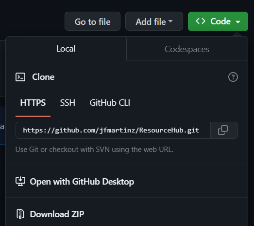
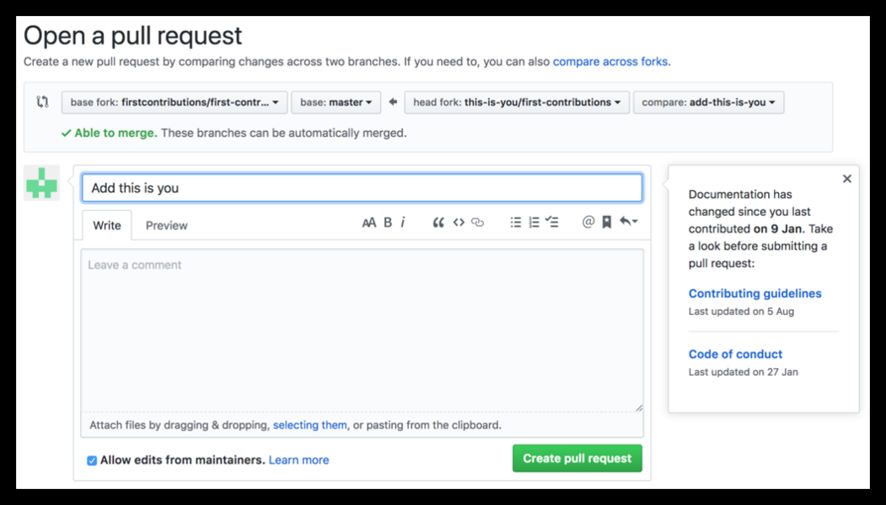

# ResourceHub [](https://github.com/sindresorhus/awesome)

[](https://github.com/firstcontributions/open-source-badges)
[](https://opensource.org/licenses/mit-license.php)
[](code_of_conduct.md)

## Welcome to ResourceHub

_ResourceHub_ is an open-source initiative aimed at two primary goals:

**Empowering Beginners:** We're here to help you start your open source journey by offering beginner-friendly tasks, making your first pull request!

**Resource Hub for Developers:** Find a curated collection of community-recommended tools, books, learning materials, etc. to enhance your projects and skills, and access it on one convenient place.

Contributing to this repo benefits not just you, but the entire **community**. It not only help you start your open source journey but also empowers fellow developers to excel in their careers using the recommended resources found by the community.

Read [CONTRIBUTING.md](https://github.com/jfmartinz/ResourceHub/blob/main/CONTRIBUTING.md) before contributing.

## Contributing

### 1. Fork the Repository

Click the "Fork" button at the top right of this repository to create your own copy.

 <br>

### 2. Clone Your Fork

Now clone the forked repository to your local machine. Go to your GitHub account, open the forked repository, click on the code button and then click the copy to clipboard icon.

 <br>

Open a terminal and run the following git command:

```bash
git clone 'url you just copied'
```

For example:

```bash
git clone https://github.com/jfmartinz/ResourceHub.git
```

> Note: Get the HTTPS not the SSH

### 3. Create a branch

Change to the repository directory on your computer (if you are not already there):

```bash
cd ResourceHub
```

Make a meaningful name for your new branch, and then create and switch to it using this command:

```bash
git checkout -b new-branch-name
```

> Note: Replace your 'new-branch-name' with the actual branch name.

### 4. Make Your Changes

Navigate to the relevant category where you want to add your resource. Once you've identified the appropriate category and have your resource in mind, proceed to make the necessary changes within that specific category.

#### Stage Your Changes:

After making your changes, you need to stage the changes for commit using the `git add` command. To stage all changes, use:

```bash
git add .
```

#### Commit Your Changes:

Commit your staged changes with a descriptive commit message that explains the purpose of your changes. Use the `git commit` command:

```bash
git commit -m "Your descriptive commit message here"
```

> Note: Replace "Your descriptive commit message here" with a concise and informative message.

#### Push Your Changes:

```bash
git push origin your-branch-name
```

> Note: Replace 'your-branch-name' with the name of your branch.

### 5. Submit your changes for review

If you go to your repository on GitHub, you'll see a `Compare & pull request` button. Click on that button.
<br>

<br>

Now submit the pull request.

## Congratulations on Your First Pull Request! 🎉

Congrats! You just completed the standard `fork -> clone -> edit -> pull request` workflow that you'll often encounter as a contributor!

Your first PR marks the beginning of your open source journey. Thanks for your contribution—small steps lead to big impacts! Keep up the great work! 🚀

## License 🛡️

ResourceHub is licensed under the MIT License - see the [LICENSE](https://github.com/jfmartinz/ResourceHub/blob/main/LICENSE) file for details.

### Connect with me 🤝

Twitter: [@jfmartinz](https://twitter.com/jfmartinz)<br>
LinkedIn: [@jfmartinz](https://www.linkedin.com/in/jfmartinz/)<br>
Github: [@jfmartinz](https://github.com/jfmartinz)<br>

Show some ❤️ by giving this repository a ⭐️
